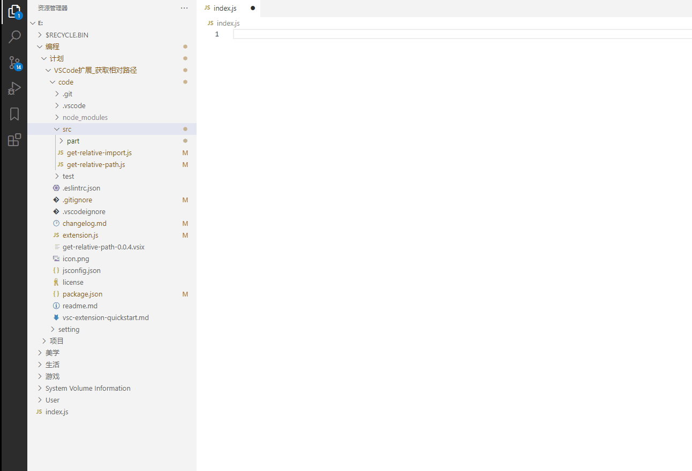

# get-relative-path

A tool to get the path of the target file relative to the current file in the editor.

[Link: https://marketplace.visualstudio.com/items?itemName=WingsJ.get-relative-path](https://marketplace.visualstudio.com/items?itemName=WingsJ.get-relative-path)

## Usage

When a file is in the current editor, click the right button on the target file, and choose 'Get relative path' or 'Get relative path with import'.



## Setting

### Name format

The format of the variable name can be configured.

```
{
  "getRelativePath.nameFormat": "pascal"
}
```

- pascal
- camel
